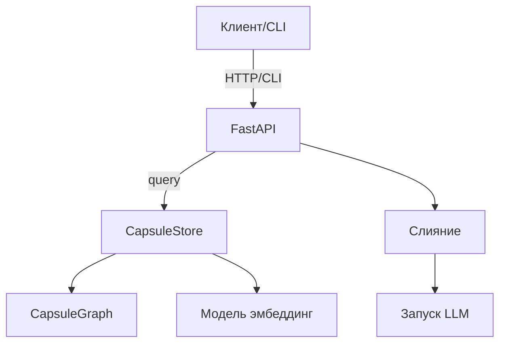

# SIGLA — Семантический Информационный Граф и Лёгкие Агенты

**Версия:** 0.9 – внутренний превью-релиз  
**Статус:** Основные функции реализованы; для продакшена требуются расширенные тесты и аудит безопасности.

---

## 1. Краткое описание
SIGLA — это локальный движок знаний и Retrieval-Augmented Generation (RAG), позволяющий компактным LLM (7-13B) рассуждать с внешней памятью *капсул* — атомарных фактов, выводов или фрагментов кода.  
Цель — приблизить качество ответов к 70B-моделям без дорогих серверов.

Преимущества:
* **Семантический индекс** на FAISS.  
* **CapsuleGraph** для расширения контекста.  
* Слияние капсул в лаконичный **prompt** или **KV-префикс**.  
* Доступ через **FastAPI** и **CLI**.  
* Полностью офлайн, работает на CPU/GPU пользователя.

---

## 2. Базовые понятия
| Термин | Описание |
|--------|----------|
| **Капсула** | `text`, опц. `tags`, `links`, `weights`, `source`, `timestamp`. Одна мысль/факт. |
| **CapsuleStore** | FAISS + метаданные. Инжест, поиск, авто-линк, сохранение. |
| **CapsuleGraph** | Граф капсул; рёбра взвешены сходством. Алгоритмы: BFS и random walk. |
| **DSL** | Мини-язык (`INTENT`, `RETRIEVE`, `MERGE`, `INJECT`, `EXPAND`, `ANALYZE`). |
| **KV-префикс** | Список токен-ID, вставляемых перед вопросом. |

---

## 3. Архитектура


---

## 4. Компоненты
1. **sigla.core** — эмбеддинги, индексы, авто-ссылки.  
2. **sigla.graph** — расширение графа, фильтр по весу.  
3. **sigla.server** — FastAPI, Prometheus, SSE, авто-реиндекс.  
4. **sigla.scripts** — богатый CLI.  
5. **sigla.runner** — запуск `.capsulegraph`, поддержка `--prefix`.  
6. **sigla.registry** — реестр модулей (SQLite/Neo4j).

---

## 5. REST API (сокращённо)
`/search`, `/ask`, `/update`, `/walk`, `/compress`, `/prune`, `/reindex`, `/metrics`, `/events`.  
`/ask?kv=true` возвращает `tokens` для KV-инъекции.

---

## 6. Шпаргалка CLI
```bash
sigla ingest docs/ -o wiki        # Инжест
sigla serve -s wiki --port 8080   # Сервер
curl 127.0.0.1:8080/ask?query=AI  # Вопрос
sigla walk ...                    # Расширение графа
sigla shell -s wiki               # Interactive REPL
```

---

## 7. Форматы
* `*.index` + `*.json` — индекс/мета.  
* `.capsulegraph` — tar.gz с квант. моделью, метой и токен-капами.

---

## 8. Метрики Prometheus
`sigla_requests_total`, `sigla_request_latency_seconds`, `sigla_capsules_total`.

---

## 9. Безопасность
API-key (`SIGLA_API_KEY`), GDPR-совместимость (prune/export), офлайн режим.

---

## 10. Дорожная карта
* ↑ покрытие тестами.  
* Декей весов со временем.  
* Веб-UI на `/events`.  
* Адаптеры llama.cpp / GGUF.  
* Защита продакшена: rate-limit, RBAC.

---

> Файл `PRODUCT_SPEC_RU.md` — каноничное описание на русском. 